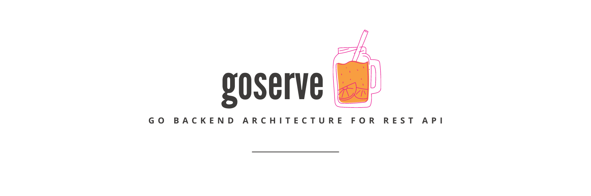

# goserve - Go Backend Architecture

[](https://github.com/unusualcodeorg/goserve/actions/workflows/docker_compose.yml)
[](https://github.com/unusualcodeorg/goservegen)
[](https://github.com/unusualcodeorg/goservegen/raw/main/project.zip)



## Create A Blog Service 

This project is a fully production-ready solution designed to implement best practices for building performant and secure backend REST API services. It provides a robust architectural framework to ensure consistency and maintain high code quality. The architecture emphasizes feature separation, facilitating easier unit and integration testing.

## Framework
- Go
- Gin
- jwt
- mongodriver
- go-redis
- Validator
- Viper
- Crypto

**Highlights**
- API key support
- Token based Authentication
- Role based Authorization
- Unit Tests
- Integration Tests
- Modular codebase

## Architecture
The goal is to make each API independent from one another and only share services among them. This will make code reusable and reduce conflicts while working in a team. 

The APIs will have separate directory based on the endpoint. Example `blog` and `blogs` will have seperate directory whereas `blog`, `blog/author`, and `blog/editor` will share common resources and will live inside same directory.

### Startup Flow
cmd/main → startup/server → module, mongo, redis, router → api/[feature]/middlewares → api/[feature]/controller -> api/[feature]/service, authentication, authorization → handlers → sender

### API Structure
```
Sample API
├── dto
│   └── create_sample.go
├── model
│   └── sample.go
├── controller.go
└── service.go
```

- Each feature API lives under `api` directory
- The request and response body is sent in the form of a DTO (Data Transfer Object) inside `dto` directory
- The database collection model lives inside `model` directory
- Controller is responsible for defining endpoints and corresponding handlers
- Service is the main logic component and handles data. Controller interact with a service to process a request. A service can also interact with other services.
 
## Project Directories
1. **api**: APIs code 
2. **arch**: It provide framework and base implementation for creating the architecture
3. **cmd**: main function to start the program
4. **common**: code to be used in all the apis
5. **config**: load environment variables
6. **keys**: stores server pem files for token
7. **startup**: creates server and initializes database, redis, and router
8. **tests**: holds the integration tests
9. **utils**: contains utility functions

**Helper/Optional Directories**
1. **.extra**: mongo script for initialization inside docker, other web assets and documents
2. **.github**: CI for tests
3. **.tools**: api code, RSA key generator, and .env copier
4. **.vscode**: editor config and debug launch settings

## API Design


### API DOC
[](https://documenter.getpostman.com/view/1552895/2sA3XWdefu)

## Installation Instructions
vscode is the recommended editor - dark theme 

**1. Get the repo**

```bash
git clone https://github.com/unusualcodeorg/goserve.git
```

**2. Generate RSA Keys**
```
go run .tools/rsa/keygen.go
```

**3. Create .env files**
```
go run .tools/copy/envs.go 
```

**4. Run Docker Compose**
- Install Docker and Docker Compose. [Find Instructions Here](https://docs.docker.com/install/).

```bash
docker-compose up --build
```
-  You will be able to access the api from http://localhost:8080

**5. Run Tests**
```bash
docker exec -t goserver go test -v ./...
```

If having any issue
- Make sure 8080 port is not occupied else change SERVER_PORT in **.env** file.
- Make sure 27017 port is not occupied else change DB_PORT in **.env** file.
- Make sure 6379 port is not occupied else change REDIS_PORT in **.env** file.

## Run on the local machine
```bash
go mod tidy
```

Keep the docker container for `mongo` and `redis` running and **stop** the `goserve` docker container

Change the following hosts in the **.env** and **.test.env**
- DB_HOST=localhost
- REDIS_HOST=localhost

Best way to run this project is to use the vscode `Run and Debug` button. Scripts are available for debugging and template generation on vscode.

### Optional - Running the app from terminal
```bash
go run cmd/main.go
```

## Template
New api creation can be done using command. `go run .tools/apigen.go [feature_name]`. This will create all the required skeleton files inside the directory api/[feature_name]

```bash
go run .tools/apigen.go sample
```

## Read the Article to understand this project
[How to Architect Good Go Backend REST API Services](https://medium.com/@janishar.ali/how-to-architecture-good-go-backend-rest-api-services-14cc4730c05b)

## How to use this architecture in your project?
You can use [goservegen](https://github.com/unusualcodeorg/goservegen) CLI to generate starter project for this architecture. 
> Check out the repo [github.com/unusualcodeorg/goservegen](https://github.com/unusualcodeorg/goservegen) for more information.

## Documentation
Information about the framework

### Model
`api/sample/model/sample.go`

```go
package model

import (
  "context"
  "time"

  "github.com/go-playground/validator/v10"
  "github.com/unusualcodeorg/goserve/arch/mongo"
  "go.mongodb.org/mongo-driver/bson"
  "go.mongodb.org/mongo-driver/bson/primitive"
  mongod "go.mongodb.org/mongo-driver/mongo"
)

const CollectionName = "samples"

type Sample struct {
  ID        primitive.ObjectID `bson:"_id,omitempty" validate:"-"`
  Field     string             `bson:"field" validate:"required"`
  Status    bool               `bson:"status" validate:"required"`
  CreatedAt time.Time          `bson:"createdAt" validate:"required"`
  UpdatedAt time.Time          `bson:"updatedAt" validate:"required"`
}

func NewSample(field string) (*Sample, error) {
  time := time.Now()
  doc := Sample{
    Field:     field,
    Status:    true,
    CreatedAt: time,
    UpdatedAt: time,
  }
  if err := doc.Validate(); err != nil {
    return nil, err
  }
  return &doc, nil
}

func (doc *Sample) GetValue() *Sample {
  return doc
}

func (doc *Sample) Validate() error {
  validate := validator.New()
  return validate.Struct(doc)
}

func (*Sample) EnsureIndexes(db mongo.Database) {
  indexes := []mongod.IndexModel{
    {
      Keys: bson.D{
        {Key: "_id", Value: 1},
        {Key: "status", Value: 1},
      },
    },
  }
  
  mongo.NewQueryBuilder[Sample](db, CollectionName).Query(context.Background()).CreateIndexes(indexes)
}
```

#### Notes: The Model implements the interface 
`arch/mongo/database`

```golang
type Document[T any] interface {
  EnsureIndexes(Database)
  GetValue() *T
  Validate() error
}
``` 

### DTO
`api/sample/dto/create_sample.go`

```go
package dto

import (
  "fmt"
  "time"

  "github.com/go-playground/validator/v10"
  "go.mongodb.org/mongo-driver/bson/primitive"
)

type InfoSample struct {
  ID        primitive.ObjectID `json:"_id" binding:"required"`
  Field     string             `json:"field" binding:"required"`
  CreatedAt time.Time          `json:"createdAt" binding:"required"`
}

func EmptyInfoSample() *InfoSample {
  return &InfoSample{}
}

func (d *InfoSample) GetValue() *InfoSample {
  return d
}

func (d *InfoSample) ValidateErrors(errs validator.ValidationErrors) ([]string, error) {
  var msgs []string
  for _, err := range errs {
    switch err.Tag() {
    case "required":
      msgs = append(msgs, fmt.Sprintf("%s is required", err.Field()))
    case "min":
      msgs = append(msgs, fmt.Sprintf("%s must be min %s", err.Field(), err.Param()))
    case "max":
      msgs = append(msgs, fmt.Sprintf("%s must be max %s", err.Field(), err.Param()))
    default:
      msgs = append(msgs, fmt.Sprintf("%s is invalid", err.Field()))
    }
  }
  return msgs, nil
}
```

#### Notes: The DTO implements the interface 
`arch/network/interfaces.go`

```golang
type Dto[T any] interface {
  GetValue() *T
  ValidateErrors(errs validator.ValidationErrors) ([]string, error)
}
``` 

### Service
`api/sample/service.go`

```go
package sample

import (
  "github.com/unusualcodeorg/goserve/api/sample/dto"
  "github.com/unusualcodeorg/goserve/api/sample/model"
  "github.com/unusualcodeorg/goserve/arch/mongo"
  "github.com/unusualcodeorg/goserve/arch/network"
  "github.com/unusualcodeorg/goserve/arch/redis"
  "go.mongodb.org/mongo-driver/bson"
  "go.mongodb.org/mongo-driver/bson/primitive"
)

type Service interface {
  FindSample(id primitive.ObjectID) (*model.Sample, error)
}

type service struct {
  network.BaseService
  sampleQueryBuilder mongo.QueryBuilder[model.Sample]
  infoSampleCache    redis.Cache[dto.InfoSample]
}

func NewService(db mongo.Database, store redis.Store) Service {
  return &service{
    BaseService:  network.NewBaseService(),
    sampleQueryBuilder: mongo.NewQueryBuilder[model.Sample](db, model.CollectionName),
    infoSampleCache: redis.NewCache[dto.InfoSample](store),
  }
}

func (s *service) FindSample(id primitive.ObjectID) (*model.Sample, error) {
  filter := bson.M{"_id": id}

  msg, err := s.sampleQueryBuilder.SingleQuery().FindOne(filter, nil)
  if err != nil {
    return nil, err
  }

  return msg, nil
}
```

#### Notes: The Service embeds the interface 
`arch/network/interfaces.go`

```golang
type BaseService interface {
  Context() context.Context
}
``` 

- Database Query: `mongo.QueryBuilder[model.Sample]` provide the methods to make common mongo queries for the model `model.Sample`
- Redis Cache: `redis.Cache[dto.InfoSample]` provide the methods to make common redis queries for the DTO `dto.InfoSample`

### Controller
`api/sample/controller.go`

```go
package sample

import (
  "github.com/gin-gonic/gin"
  "github.com/unusualcodeorg/goserve/api/sample/dto"
  "github.com/unusualcodeorg/goserve/common"
  coredto "github.com/unusualcodeorg/goserve/arch/dto"
  "github.com/unusualcodeorg/goserve/arch/network"
  "github.com/unusualcodeorg/goserve/utils"
)

type controller struct {
  network.BaseController
  common.ContextPayload
  service Service
}

func NewController(
  authMFunc network.AuthenticationProvider,
  authorizeMFunc network.AuthorizationProvider,
  service Service,
) network.Controller {
  return &controller{
    BaseController: network.NewBaseController("/sample", authMFunc, authorizeMFunc),
    ContextPayload: common.NewContextPayload(),
    service:  service,
  }
}

func (c *controller) MountRoutes(group *gin.RouterGroup) {
  group.GET("/id/:id", c.getSampleHandler)
}

func (c *controller) getSampleHandler(ctx *gin.Context) {
  mongoId, err := network.ReqParams(ctx, coredto.EmptyMongoId())
  if err != nil {
    c.Send(ctx).BadRequestError(err.Error(), err)
    return
  }

  sample, err := c.service.FindSample(mongoId.ID)
  if err != nil {
    c.Send(ctx).NotFoundError("sample not found", err)
    return
  }

  data, err := utils.MapTo[dto.InfoSample](sample)
  if err != nil {
    c.Send(ctx).InternalServerError("something went wrong", err)
    return
  }

  c.Send(ctx).SuccessDataResponse("success", data)
}
```

#### Notes: The Controller implements the interface 
`arch/network/interfaces.go`

```golang
type Controller interface {
  BaseController
  MountRoutes(group *gin.RouterGroup)
}

type BaseController interface {
  ResponseSender
  Path() string
  Authentication() gin.HandlerFunc
  Authorization(role string) gin.HandlerFunc
}

type ResponseSender interface {
  Debug() bool
  Send(ctx *gin.Context) SendResponse
}

type SendResponse interface {
  SuccessMsgResponse(message string)
  SuccessDataResponse(message string, data any)
  BadRequestError(message string, err error)
  ForbiddenError(message string, err error)
  UnauthorizedError(message string, err error)
  NotFoundError(message string, err error)
  InternalServerError(message string, err error)
  MixedError(err error)
}
``` 

### Enable Controller In Module
`startup/module.go`

```go
import (
  ...
  "github.com/unusualcodeorg/goserve/api/sample"
)

...

func (m *module) Controllers() []network.Controller {
  return []network.Controller{
    ...
    sample.NewController(m.AuthenticationProvider(), m.AuthorizationProvider(), sample.NewService(m.DB, m.Store)),
  }
}
```

### Indexing (If Needed)
`startup/indexes.go`

```go
import (
  ...
  sample "github.com/unusualcodeorg/goserve/api/sample/model"
)

func EnsureDbIndexes(db mongo.Database) {
  go mongo.Document[sample.Sample](&sample.Sample{}).EnsureIndexes(db)
  ...
}
```

## Go Microservices Architecture using goserve
`goserve` also provides `micro` package to build REST API microservices. Find the microservices version of this blog service project at [github.com/unusualcodeorg/gomicro](https://github.com/unusualcodeorg/gomicro)

[Article - How to Create Microservices — A Practical Guide Using Go](https://medium.com/@janishar.ali/how-to-create-microservices-a-practical-guide-using-go-35445a821513)

## Find this project useful ? :heart:
* Support it by clicking the :star: button on the upper right of this page. :v:

## More on YouTube channel - Unusual Code
Subscribe to the YouTube channel `UnusualCode` for understanding the concepts used in this project:

[](https://www.youtube.com/@unusualcode)

## Contribution
Please feel free to fork it and open a PR.